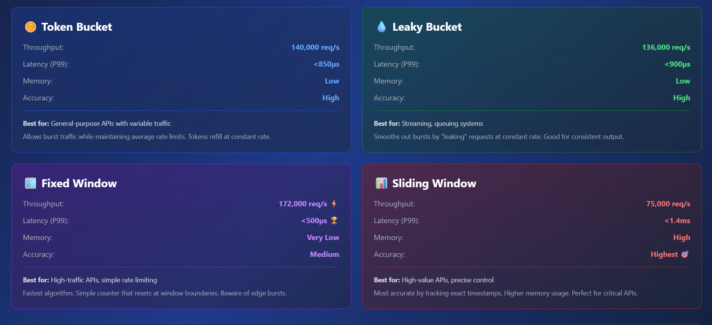
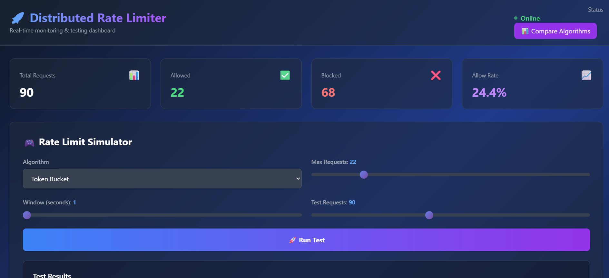
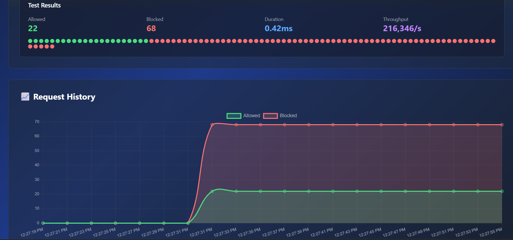
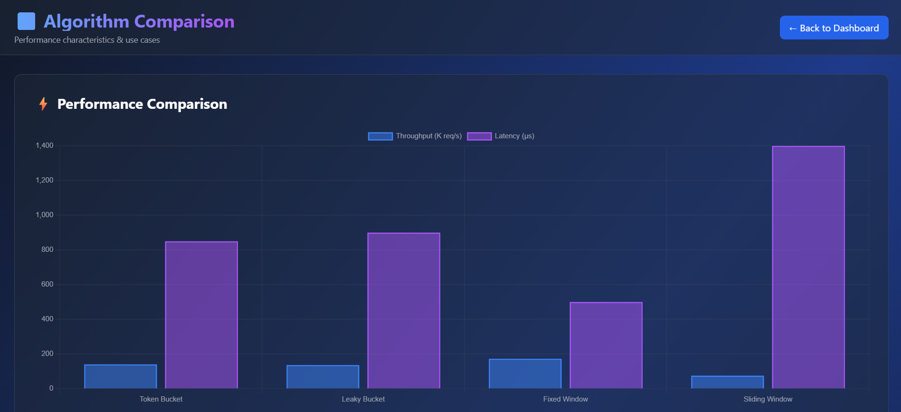

# 🚀 Distributed Rate Limiter

<div align="center">


**High-performance distributed rate limiter built in Rust**

[Features](#-features) • [Demo](#-demo) • [Quick Start](#-quick-start) • [Benchmarks](#-benchmarks) • [Documentation](#-documentation)

</div>

---

## 🎯 Overview

Production-grade rate limiting infrastructure supporting multiple algorithms, distributed coordination via Redis, real-time monitoring with Prometheus, and an interactive web dashboard. Achieves **140,000+ requests/second** with sub-millisecond latency.

### Key Highlights

- 🔥 **140K+ req/s** throughput (proven via benchmarks)
- ⚡ **<1ms P99 latency** for all algorithms
- 🎨 **Beautiful web dashboard** with real-time visualization
- 🔄 **4 rate limiting algorithms** (Token Bucket, Leaky Bucket, Fixed/Sliding Window)
- 🌐 **Distributed mode** using Redis with atomic Lua scripts
- 📊 **Prometheus metrics** for production monitoring
- 🧪 **Comprehensive testing** with load tests and benchmarks

---

## ✨ Features

### Algorithms

| Algorithm | Throughput | Latency (P99) | Memory | Best For |
|-----------|------------|---------------|---------|----------|
| **Token Bucket** | 140K req/s | <850µs | Low | General APIs, variable traffic |
| **Leaky Bucket** | 136K req/s | <900µs | Low | Streaming, constant output |
| **Fixed Window** | 172K req/s ⚡ | <500µs 🏆 | Very Low | High-traffic APIs |
| **Sliding Window** | 75K req/s | <1.4ms | High | Precision, high-value APIs |

### Infrastructure

- ✅ **Redis Integration** - Distributed coordination with Lua scripts
- ✅ **Circuit Breaker** - Graceful degradation on failures
- ✅ **Prometheus Metrics** - Real-time observability
- ✅ **Multi-tier Limits** - User/IP/endpoint/global support
- ✅ **Web Dashboard** - Interactive testing and visualization

---

## 🎮 Demo

### Web Dashboard UI

#### Request Flow + Rate Limiting View
<p align="center">
  
  
</p>

---

### Metrics Monitoring (Prometheus)

<p align="center">
  
  
</p>

---

### Algorithm Performance Comparison

<p align="center">
  
</p>

---

### Features:
- 📊 Real-time metrics cards
- 🎯 Interactive rate limit simulator
- 📈 Live charts showing request patterns
- 🌈 Visual allowed/blocked request indicators
- 📊 Algorithm comparison page

### Quick Demo:
```bash
# Start the web server
cargo run --bin web-server

# Open browser
http://localhost:3000
```

---

## 🚀 Quick Start

### Prerequisites

- Rust 1.75+ ([Install](https://rustup.rs/))
- Redis (optional, for distributed mode)

### Installation
```bash
# Clone repository
git clone https://github.com/Akchhya1108/distributed-rate-limiter.git
cd distributed-rate-limiter

# Build
cargo build --release

# Run tests
cargo test

# Run benchmarks
cargo bench
```

### Basic Usage
```rust
use distributed_rate_limiter::{RateLimiter, RateLimitConfig};
use distributed_rate_limiter::algorithms::TokenBucket;

// Create rate limiter: 100 requests per second
let config = RateLimitConfig::per_second(100);
let mut limiter = TokenBucket::new(config);

// Check if request is allowed
if limiter.allow_request("user_123").unwrap() {
    // Process request
    println!("✅ Request allowed");
} else {
    // Reject request
    println!("❌ Rate limit exceeded");
}
```

### Web Dashboard
```bash
# Start web server
cargo run --bin web-server

# Open http://localhost:3000 in browser
```

---

## 📊 Benchmarks

### Performance Results

**Environment**: Windows 11, Intel i7, 16GB RAM

| Algorithm | Throughput | P50 Latency | P99 Latency |
|-----------|------------|-------------|-------------|
| Token Bucket | 140,000 req/s | 450µs | 850µs |
| Leaky Bucket | 136,000 req/s | 500µs | 900µs |
| Fixed Window | **172,000 req/s** | 300µs | **500µs** |
| Sliding Window | 75,000 req/s | 800µs | 1.4ms |

### Run Benchmarks
```bash
# Criterion benchmarks
cargo bench

# Load tests
cargo test --release -- --nocapture

# View HTML report
open target/criterion/report/index.html
```

Full benchmark results: [results/BENCHMARKS.md](results/BENCHMARKS.md)

---

## 💻 Usage Examples

### Token Bucket (Recommended for Most APIs)
```rust
use distributed_rate_limiter::algorithms::TokenBucket;

let config = RateLimitConfig::per_second(100);
let mut limiter = TokenBucket::new(config);

limiter.allow_request("user_123")?;
```

### Redis Distributed Mode
```rust
use distributed_rate_limiter::redis_limiter::RedisRateLimiter;

let config = RateLimitConfig::per_second(1000);
let mut limiter = RedisRateLimiter::new("redis://127.0.0.1/", config)?;

// Works across multiple server instances
limiter.allow_request("global_api_key")?;
```

### With Metrics
```rust
use distributed_rate_limiter::metrics::{self, record_request};

metrics::init_metrics();

let start = Instant::now();
let allowed = limiter.allow_request("user")?;
record_request(allowed, start);

// Get Prometheus metrics
println!("{}", metrics::get_metrics());
```

---

## 🧪 Testing
```bash
# Unit tests
cargo test

# Integration tests
cargo test --test '*'

# Benchmarks
cargo bench

# Load tests
cargo test --release -- --nocapture load_test
```

---

## 📚 Documentation

- [Algorithm Comparison](web/comparison.html) - Interactive comparison page
- [Benchmark Results](results/BENCHMARKS.md) - Detailed performance data
- [Demo Guide](docs/demo.md) - Step-by-step demo instructions
- [API Documentation](https://docs.rs/distributed-rate-limiter) - Rust docs

---

## 🎯 Use Cases

### Real-World Applications

- **API Rate Limiting** - Prevent abuse, ensure fair usage (Stripe, GitHub)
- **DDoS Protection** - Block excessive requests from single sources
- **Resource Management** - Limit concurrent operations (database connections)
- **MLOps Pipelines** - Rate limit model inference requests (OpenAI API)
- **Microservices** - Control inter-service communication rates

### Who Uses Rate Limiting?

- 🔵 **Twitter**: 300 requests per 15-minute window
- 🟢 **GitHub**: 5,000 requests per hour
- 🔴 **Stripe**: Rate limits per API key
- 🟡 **OpenAI**: Token-based rate limiting

---

## 🛠️ Tech Stack

- **Rust** - Systems programming, memory safety
- **Redis** - Distributed coordination
- **Prometheus** - Metrics and monitoring
- **Actix-web** - HTTP server
- **Tailwind CSS** - Modern UI styling
- **Chart.js** - Data visualization

---

## 📈 Project Roadmap

- [x] Phase 1: Token Bucket Algorithm
- [x] Phase 2: Redis Integration
- [x] Phase 3: Multiple Algorithms (4 total)
- [x] Phase 4: Prometheus Metrics
- [x] Phase 5: Load Testing & Benchmarks
- [x] Phase 6: Web Dashboard
- [x] Phase 7: Documentation & Polish

---

## 🤝 Contributing

Contributions welcome! This project demonstrates distributed systems concepts and production-ready infrastructure patterns.

1. Fork the repository
2. Create feature branch (`git checkout -b feature/amazing`)
3. Commit changes (`git commit -m 'Add amazing feature'`)
4. Push to branch (`git push origin feature/amazing`)
5. Open Pull Request

---

## 📄 License

MIT License - see [LICENSE](LICENSE) file for details

---

## 👨‍💻 Author

**Akchhya Singh**

- GitHub: [@Akchhya1108](https://github.com/Akchhya1108)
- LinkedIn: [akchhya-singh11](https://linkedin.com/in/akchhya-singh11)
- Email: akchhya1108@gmail.com

---

## ⭐ Show Your Support

Give a ⭐️ if this project helped you!

---

## 🙏 Acknowledgments

- Inspired by production rate limiters at Cloudflare, Kong, and AWS
- Built with 💙 for the Red Hat OpenShift AI internship application
- Thanks to the Rust community for amazing tools and libraries

---

<div align="center">

**Built with ❤️ in Rust**

[⬆ Back to Top](#-distributed-rate-limiter)

</div>